# signalaf.com — Site Architecture Audit

> Crawl run 2026-07-09 04:06 UTC via Screaming Frog SEO Spider (free tier).
> Source files: `internal_all.csv`, `external_all.csv`, `orphan_pages.csv`, `redirects.csv`,
> `Force-Directed Crawl Diagram.svg`, `Force-Directed Directory Tree Diagram.svg`.

---

## 1. Crawl Summary

| Metric | Value |
|--------|-------|
| Total URLs crawled | 102 |
| HTML pages (content) | 32 |
| Static assets (_next/css/js) | 57 |
| Redirects | 46 (all `/leaderboard` → `/board/all`, 307) |
| 404 errors | 1 (`/submit`) |
| Orphan pages | 0 |
| External links | 25 (to 14 domains) |
| External errors | 4 (2× 403, 2× 429) |

**Good news:** Zero orphan pages. Every page is linked from somewhere. The site is well-connected.

---

## 2. Site Architecture (Mermaid)

```mermaid
graph TD
    HOME["/ (Homepage)"]

    %% Core app pages
    BOARD_ALL["/board/all — All-time Leaderboard"]
    BOARD_30D["/board/30d — 30-day Leaderboard"]
    COMPARE["/compare — Operator Comparison"]
    HALL["/hall — Hall of Signal"]
    SCORE["/score — Score your cascade"]
    SCORE_PASTE["/score/paste — Quick paste preview"]
    SUBMIT["/submit — 404 BROKEN"]
    UPGRADE["/upgrade?tier=patron — Back the build"]
    METHODOLOGY["/methodology — The SigRank Index"]
    ABOUT["/about — About"]
    SCIENCE["/science — Conservation Law"]
    RESEARCH["/research/q1-2026 — Q1 Report"]

    %% Wiki cluster
    WIKI["/wiki — Wiki hub"]
    WIKI_AGENT["/wiki/local-agent"]
    WIKI_3DEG["/wiki/three-degrees"]
    WIKI_VERIFY["/wiki/verification"]
    WIKI_REFINE["/wiki/methodology-refinement"]
    WIKI_ALONGSIDE["/wiki/measured-alongside"]
    WIKI_DRIFT["/wiki/signal-drift"]

    %% SEO content — Guides (5 crawled)
    GUIDE_CASCADE["/guides/how-to-read-your-cascade"]
    GUIDE_EFFICIENCY["/guides/how-to-measure-ai-coding-efficiency"]
    GUIDE_WASTE["/guides/how-to-reduce-token-waste"]
    GUIDE_YIELD["/guides/how-to-improve-your-yield"]
    GUIDE_TRACK["/guides/how-to-track-token-cascade"]

    %% SEO content — Tools (4)
    TOOL_YIELD["/tools/yield-calculator"]
    TOOL_CLASS["/tools/operator-class-checker"]
    TOOL_CASCADE["/tools/cascade-comparator"]
    TOOL_WASTE["/tools/token-waste-calculator"]

    %% SEO content — Metrics (6)
    METRIC_CACHE["/metrics/cache-hit-rate"]
    METRIC_LEVERAGE["/metrics/leverage"]
    METRIC_YIELD["/metrics/yield-cascade"]
    METRIC_COMPRESSION["/metrics/compression-ratio"]
    METRIC_VELOCITY["/metrics/velocity"]
    METRIC_SNR["/metrics/signal-to-noise-ratio"]

    %% SEO content — Alternatives (2 crawled)
    ALT_METRICS["/alternatives/ai-coding-metrics"]
    ALT_CCUSAGE["/alternatives/ccusage-alternatives"]

    %% SEO content — VS (4 crawled)
    VS_CURSOR["/vs/cursor"]
    VS_WAKATIME["/vs/wakatime"]
    VS_LMSYS["/vs/lmsys-arena"]
    VS_CCUSAGE["/vs/ccusage"]

    %% SEO content — Blog (1 crawled)
    BLOG_BEST["/blog/best-ai-coding-tools-2026"]

    %% SEO content — Topic hubs (1 crawled)
    HUB_TELEMETRY["/token-telemetry"]

    %% Redirect
    LEADERBOARD["/leaderboard → 307 → /board/all"]

    %% Connections
    HOME --> BOARD_ALL
    HOME --> COMPARE
    HOME --> HALL
    HOME --> SCORE
    HOME --> ABOUT
    HOME --> WIKI
    HOME --> METHODOLOGY
    HOME --> SCIENCE
    HOME --> LEADERBOARD

    LEADERBOARD -.->|307 redirect| BOARD_ALL

    WIKI --> WIKI_AGENT
    WIKI --> WIKI_3DEG
    WIKI --> WIKI_VERIFY
    WIKI --> WIKI_REFINE
    WIKI --> WIKI_ALONGSIDE
    WIKI --> WIKI_DRIFT

    SCORE --> SCORE_PASTE
    SCORE --> SUBMIT

    %% SEO pages all link back to board + nav
    GUIDE_CASCADE --> BOARD_ALL
    GUIDE_EFFICIENCY --> BOARD_ALL
    GUIDE_WASTE --> BOARD_ALL
    GUIDE_YIELD --> BOARD_ALL
    GUIDE_TRACK --> BOARD_ALL
    TOOL_YIELD --> BOARD_ALL
    TOOL_CLASS --> BOARD_ALL
    TOOL_CASCADE --> BOARD_ALL
    TOOL_WASTE --> BOARD_ALL
    METRIC_CACHE --> BOARD_ALL
    METRIC_LEVERAGE --> BOARD_ALL
    METRIC_YIELD --> BOARD_ALL
    METRIC_COMPRESSION --> BOARD_ALL
    METRIC_VELOCITY --> BOARD_ALL
    METRIC_SNR --> BOARD_ALL
    ALT_METRICS --> BOARD_ALL
    ALT_CCUSAGE --> BOARD_ALL
    VS_CURSOR --> BOARD_ALL
    VS_WAKATIME --> BOARD_ALL
    VS_LMSYS --> BOARD_ALL
    VS_CCUSAGE --> BOARD_ALL
    BLOG_BEST --> BOARD_ALL
    HUB_TELEMETRY --> BOARD_ALL

    %% Styling
    classDef broken fill:#ff4444,color:#fff,stroke:#cc0000
    classDef redirect fill:#ffaa00,color:#000,stroke:#cc8800
    classDef hub fill:#4488ff,color:#fff,stroke:#2266cc
    classDef seo fill:#44aa44,color:#fff,stroke:#228822

    class SUBMIT broken
    class LEADERBOARD redirect
    class WIKI,HOME,BOARD_ALL hub
    class GUIDE_CASCADE,GUIDE_EFFICIENCY,GUIDE_WASTE,GUIDE_YIELD,GUIDE_TRACK,TOOL_YIELD,TOOL_CLASS,TOOL_CASCADE,TOOL_WASTE,METRIC_CACHE,METRIC_LEVERAGE,METRIC_YIELD,METRIC_COMPRESSION,METRIC_VELOCITY,METRIC_SNR,ALT_METRICS,ALT_CCUSAGE,VS_CURSOR,VS_WAKATIME,VS_LMSYS,VS_CCUSAGE,BLOG_BEST,HUB_TELEMETRY seo
```

**How to view:** Paste the block above into [mermaid.live](https://mermaid.live) or any GitHub markdown file. Red = broken (404), orange = redirect, blue = hub pages, green = SEO content pages.

---

## 3. Pages Not Crawled (in sitemap but not in crawl)

The crawl found 32 HTML pages. The sitemap has more. These pages exist in the sitemap but Screaming Frog didn't find them linked from any crawled page:

| Route | In sitemap? | Likely issue |
|-------|-------------|--------------|
| `/ai-benchmarking` | Yes | Not linked from nav/footer — topic hub is orphaned from navigation |
| `/ai-coding-metrics` | Yes | Same — topic hub not in nav |
| `/ai-operator-scoring` | Yes | Same — topic hub not in nav |
| `/operator-performance` | Yes | Same — topic hub not in nav |
| `/cascade-analysis` | Yes | Not linked from nav/footer |
| `/alternatives/ai-benchmarking-tools` | Yes | Not linked from nav/footer |
| `/alternatives/token-tracking-tools` | Yes | Not linked from nav/footer |
| `/blog/how-to-benchmark-ai-coding-workflow` | Yes | Not linked from nav/footer |
| `/how-to-benchmark-ai-coding-workflow` | Yes | Not linked from nav/footer (duplicate of blog version?) |
| `/how-to-benchmark-ai-coding-workflow` (root) | Yes | Possible duplicate route |

**Note:** Screaming Frog crawls from links it discovers. Pages in the sitemap but not linked from any crawled page won't appear in the crawl. These are "sitemap orphans" — they're in the sitemap (so Google can find them) but not linked internally (so they get no link equity from the site). This is the real issue.

---

## 4. Issues Found

### 4.1 Broken Link — `/submit` (404)

**Severity: HIGH**

`/submit` returns 404. It's linked from `/score` (crawl depth 2, 1 inlink). The page exists in the codebase but the route may not be deployed or the link points to the wrong path.

**Fix:** Check `app/submit/page.tsx` — does it exist? If the submit flow is handled elsewhere (e.g., the MCP agent), remove the link from `/score`. If the page should exist, fix the route.

### 4.2 Redirect Chain — `/leaderboard` → 307 → `/board/all` (46 instances)

**Severity: MEDIUM**

Every page that links to `/leaderboard` in the nav hits a 307 redirect to `/board/all`. That's 46 redirect hits across the site — every page on the site wastes a round-trip on the nav link.

**Fix:** Change the nav link from `/leaderboard` to `/board/all` directly. One-line fix in the nav component. Eliminates 46 redirects.

### 4.3 Sitemap Orphans — 10 pages in sitemap but not linked internally

**Severity: MEDIUM**

10 pages are in the sitemap but not linked from any crawled page:
- 4 topic hubs (`/ai-benchmarking`, `/ai-coding-metrics`, `/ai-operator-scoring`, `/operator-performance`)
- 1 content page (`/cascade-analysis`)
- 2 alternatives pages (`/alternatives/ai-benchmarking-tools`, `/alternatives/token-tracking-tools`)
- 2 how-to pages (`/how-to-benchmark-ai-coding-workflow` at root and `/blog/how-to-benchmark-ai-coding-workflow`)
- 1 blog post (`/blog/how-to-benchmark-ai-coding-workflow`)

These pages get no internal link equity. Google will crawl them from the sitemap but they won't rank as well as pages linked from the site.

**Fix:** Add these pages to the footer or a hub page. The topic hubs should link to their related content (guides, metrics, tools). The footer should link to the topic hubs.

### 4.4 Possible Duplicate Route

**Severity: LOW**

`/how-to-benchmark-ai-coding-workflow` exists at both the root and under `/blog/`. If both pages have the same content, Google will see duplicate content. One should canonicalize to the other.

**Fix:** Check if both routes render the same content. If yes, add a `canonical` tag on one pointing to the other, or remove one.

### 4.5 External Link Errors

**Severity: LOW**

| URL | Status | Issue |
|-----|--------|-------|
| `blitzstars.com` | 403 Forbidden | Blocks crawlers — likely fine for humans, but link equity doesn't pass |
| `npmjs.com/package/sigrank` | 403 Forbidden | npm blocks bots — link works for humans |
| `smithery.ai/servers/burnmydays/sigrank-mcp` | 429 Too Many Requests | Rate-limited — retry later, likely fine |
| `smithery.ai/badge/burnmydays/sigrank-mcp` | 429 Too Many Requests | Same — rate-limited |

**Fix:** No action needed. These are bot blocks, not real errors. The links work for human visitors.

### 4.6 External Redirect — ccusage GitHub

**Severity: NONE**

`github.com/ryoppippi/ccusage` returns 301 (Moved Permanently). This is GitHub's normal redirect for repo renames. The link works — it redirects to the current repo URL. No action needed.

---

## 5. Internal Linking Analysis

### Link equity distribution

| Page | Inlinks | % of total | Role |
|------|---------|------------|------|
| `/board/all` | 43 | 100% | Hub — every page links to it via nav |
| `/` (homepage) | 43 | 100% | Hub — every page links to it via nav |
| `/compare` | 43 | 100% | Hub — every page links to it via nav |
| `/score` | 43 | 100% | Hub — every page links to it via nav |
| `/wiki` | 43 | 100% | Hub — every page links to it via nav |
| `/about` | 43 | 100% | Hub — every page links to it via nav |
| `/science` | 43 | 100% | Hub — every page links to it via nav (footer) |
| `/methodology` | 12 | 27.9% | Linked from homepage + some content |
| `/hall` | 43 | 100% | Linked from nav |
| `/upgrade?tier=patron` | 1 | 2.3% | Only linked from one place |
| `/research/q1-2026` | 2 | 4.7% | Low visibility |
| `/score/paste` | 1 | 2.3% | Only linked from /score |
| `/board/30d` | 2 | 4.7% | Low — only linked from board/all |

**Observation:** The 34 SEO content pages (guides, tools, metrics, alternatives, vs, blog) all have 43 inlinks — but that's because they all share the same nav. They link TO the board, but nothing links TO them except the nav. They're one-way: they send equity to the board, but don't receive equity from other content pages.

**Fix:** Add cross-links between related content pages. For example:
- Each metrics page should link to the related guide and tool
- Each guide should link to the related metrics and tools
- The topic hubs should link to all their related content
- The vs/alternatives pages should link to the relevant guides

### Crawl depth

| Depth | Pages |
|-------|-------|
| 0 | 1 (homepage) |
| 1 | 28 (most content pages — linked from nav) |
| 2 | 3 (wiki sub-pages, /score/paste, /board/30d) |

**Good:** Most pages are 1 click from the homepage. No deep pages.

---

## 6. Fix List (priority order)

| # | Issue | Severity | Fix | Effort |
|---|-------|----------|-----|--------|
| 1 | `/submit` returns 404 | HIGH | Fix route or remove link from `/score` | 5 min |
| 2 | `/leaderboard` → 307 → `/board/all` (46 redirects) | MEDIUM | Change nav link to `/board/all` | 1 min |
| 3 | 10 sitemap orphan pages not linked internally | MEDIUM | Add to footer or hub pages | 30 min |
| 4 | No cross-links between SEO content pages | MEDIUM | Add related-links sections to each content page | 1-2 hours |
| 5 | Possible duplicate route (`/how-to-benchmark-ai-coding-workflow`) | LOW | Add canonical or remove duplicate | 5 min |
| 6 | `/upgrade?tier=patron` only 1 inlink | LOW | Add to footer | 1 min |
| 7 | `/research/q1-2026` only 2 inlinks | LOW | Link from homepage or about page | 1 min |
| 8 | `/board/30d` only 2 inlinks | LOW | Add tab/link from `/board/all` | 5 min |

---

## 7. What's Working Well

- **Zero orphan pages** (in the crawl) — every crawled page is linked from somewhere
- **Shallow site** — most pages 1 click from homepage
- **Clean nav** — 7 nav items, all 200 OK (except the `/leaderboard` redirect)
- **Good metadata** — every page has unique title + meta description, no duplicates
- **Good word counts** — content pages range 468-1902 words, appropriate for SEO
- **Readability** — most pages "Fairly Easy" to "Easy" on Flesch scale
- **External links are clean** — the 403/429 errors are bot blocks, not real broken links
- **Sitemap is comprehensive** — includes all routes + dynamic operator profiles
- **No duplicate content** — Screaming Frog found no near-duplicates
- **No spelling errors** detected across the site

---

## 8. Screaming Frog Diagrams

The two SVG files from Screaming Frog are in `~/Downloads/`:
- `Force-Directed Crawl Diagram.svg` — shows the internal linking graph. The homepage is the central hub with all content pages radiating outward. The wiki cluster is visible as a sub-graph. No isolated nodes (confirms zero orphans).
- `Force-Directed Directory Tree Diagram.svg` — shows the URL/directory hierarchy. The `/guides/`, `/tools/`, `/metrics/`, `/vs/`, `/alternatives/`, `/blog/` directories are visible as branches off the root.

Open these in a browser to view — they're interactive SVGs with labeled nodes.

---

## 9. Issues Overview Report (from Screaming Frog)

> Source: `issues_overview_report.csv` — 30 issues found across the crawl.

### HIGH priority (3 issues)

| Issue | URLs | Status |
|-------|------|--------|
| Canonicals: Outside `<head>` | 1 | Likely the `/compare?a=...&b=...` canonicalised URL — Next.js renders canonical in body for client-rendered pages. Check if this is real or a rendering artifact. |
| Page Titles: Outside `<head>` | 1 | Same page likely — title rendered outside head due to client-side rendering. |
| Response Codes: Internal Client Error (4xx) | 1 | **FIXED** — `/submit` 404, fixed in commit `4cac367` |
| Canonicals: Canonicalised | 1 | The `/compare?a=signal-92b4f9f485&b=the-field` URL — canonicalised to `/compare`. This is correct behavior (query-param URL canonicalised to base). |

### MEDIUM priority (6 issues)

| Issue | URLs | Fix |
|-------|------|-----|
| Page Titles: Over 60 Characters | 8 | Shorten titles — 8 pages have titles over 60 chars (Google truncates at ~60) |
| Page Titles: Over 561 Pixels | 9 | Same issue in pixel terms — 9 titles exceed Google's pixel limit |
| Page Titles: Below 30 Characters | 8 | 8 pages have very short titles — room to add keywords/USPs |
| Page Titles: Below 200 Pixels | 2 | 2 pages have very short titles in pixel terms |
| Meta Description: Outside `<head>` | 1 | Same canonicalised page — rendering artifact |
| H1: Multiple | 1 | One page has 2 H1s — should have 1. Find and fix. |
| Canonicals: Missing | 1 | One page has no canonical — add one. |
| Content: Low Content Pages | 5 | 5 pages under 200 words — add descriptive content. Likely the board pages (`/board/all`, `/board/30d`) + `/hall` + `/upgrade` + `/score/paste`. |

### LOW priority (rest)

| Issue | URLs | Notes |
|-------|------|-------|
| Meta Description: Over 155 Characters | 34 | 34 pages have meta descriptions over 155 chars — Google truncates. Shorten. |
| Meta Description: Over 985 Pixels | 34 | Same in pixel terms. |
| H2: Duplicate | 18 | 18 pages share H2s with other pages — likely "The formula" / "What it measures" repeated across metrics pages. Not critical but could be unique. |
| H2: Missing | 6 | 6 pages have no H2 — likely the low-content pages (board, hall, upgrade). |
| H2: Non-Sequential | 1 | One page has H2 not following H1 — heading order issue. |
| H1: Duplicate | 5 | 5 pages share H1s — likely the board pages ("Burners, Builders & 10×ers"). |
| H1: Non-Sequential | 1 | One page has H1 not as first heading. |
| Images: Missing Size Attributes | 3 | 3 images lack width/height — causes layout shift (CLS). |
| Security: Missing X-Frame-Options | 100 | No `X-Frame-Options` header — clickjacking risk. Add `SAMEORIGIN`. |
| Security: Missing Referrer-Policy | 100 | No `Referrer-Policy` header — add `strict-origin-when-cross-origin`. |
| Security: Missing X-Content-Type-Options | 100 | No `X-Content-Type-Options: nosniff` header. |
| Security: Missing Content-Security-Policy | 100 | No CSP header — XSS mitigation. |
| URL: Parameters | 2 | `/upgrade?tier=patron` and `/compare?a=...&b=...` — acceptable. |
| External Client Error (4xx) | 4 | blitzstars (403), npmjs (403), smithery (429×2) — all bot blocks, not real errors. |
| Internal Redirection (3xx) | 1 | **FIXED** — `/leaderboard` → `/board/all`, fixed in commit `4cac367` |
| Readability Difficult | 1 | `/science` — Flesch score 44 (Hard). Expected for academic content. |
| Links: High External Outlinks | 1 | One page has many external links — likely `/wiki/measured-alongside` (credits to ccusage, tokscale, token-dashboard). Fine. |

### Semantic Similarity (the "semantic search" question)

Screaming Frog has a **Semantic Similarity** feature. It compares every page's content against every other page and scores how semantically similar they are (0-1). This is NOT the same as "semantic search" in the Google/AI sense — it's Screaming Frog's own content-similarity detector.

**Results from our crawl:**
- Semantically Similar pages: **0** (0.00% of 43 HTML pages)
- This means no two pages on signalaf.com are semantically similar to each other

**Why this matters:** This is actually good news. It means:
- No keyword cannibalization (two pages competing for the same search intent)
- No thin/duplicate content that confuses search engines
- Each page has a distinct semantic purpose

**What Screaming Frog's semantic features do:**
1. **Near Duplicates** — exact or near-exact content matches (md5 hash + fuzzy match). We have 0.
2. **Semantically Similar** — pages that talk about the same topic using different words. We have 0.
3. **Semantic Relevance Score** — per-URL score of how relevant it is to the site's overall topic.
4. **Closest Semantically Similar Address** — for each page, which other page is most similar to it.

The internal_all.csv has columns for all of these: `Closest Semantically Similar Address`, `Semantic Similarity Score`, `No. Semantically Similar`, `Semantic Relevance Score`. They're all empty/zero for our crawl — meaning every page is distinct.

**What this is NOT:** Screaming Frog does NOT do semantic search in the AI/LLM sense. It doesn't test whether ChatGPT or Perplexity would cite your pages. It doesn't check AI Overview visibility. It's a content-similarity tool, not a GEO/AEO tool. For actual AI-engine semantic matching, you need the tools already documented in the SEO plan (Profund, Otterly.AI, Promptwatch, AthenaHQ).

---

## 10. Security Headers (all missing)

Screaming Frog flagged 4 security headers missing on 100% of pages:

| Header | What it does | Fix |
|--------|-------------|-----|
| `X-Frame-Options: SAMEORIGIN` | Prevents clickjacking — stops your site being embedded in iframes on other domains | Add to `next.config.js` headers |
| `Referrer-Policy: strict-origin-when-cross-origin` | Prevents URL leakage in cross-origin requests | Add to `next.config.js` headers |
| `X-Content-Type-Options: nosniff` | Prevents MIME-type sniffing attacks | Add to `next.config.js` headers |
| `Content-Security-Policy` | Controls which resources can load — XSS mitigation | Add to `next.config.js` headers (more complex — needs careful policy) |

**Fix:** All 4 can be added in `next.config.js` via the `headers()` function. The first 3 are one-liners. CSP needs a policy tailored to the site's resources (Next.js, Vercel analytics, PostHog, etc.).
